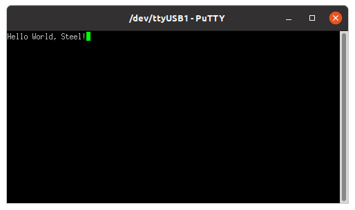

## Example system

The figure below shows an example system built with Steel, composed of an 8KB RAM memory array (**ram.v**), a memory mapped UART transmitter (**uart_tx.v**, 9600 baud rate, 1 stop bit, no parity and no control), a bus arbiter (**bus_arbiter.v**) and, of course, the Steel Core. The timer and interrupt request signals are hardwired to zero because neither timers nor interrupts are needed in this system.

</img>
 
 
<strong>Example system built with Steel</strong>

Note that the RAM memory and the UART transmitter share the interface to read/write data. The bus arbiter is used to multiplex this interface signals according to the address the core wants to access. In this example, the address 0x00010000 is used to access the UART transmitter. RAM addresses start at 0x00000000 and end at 0x00001fff. All other addresses are invalid.

> **Important:** The system was designed to work with a 100MHz clock source.

The implementation files of this system are inside the **soc** directory. The **vivado** directory has the project and implementation of this system for an Artix-7 FPGA (Digilent Nexys-4 board). The **util** directory has an example program (**hello.c**) for this system. The program sends the string "Hello World, Steel!" through the UART transmitter.

If you have the Nexys-4 board and Vivado you can run this program following these instructions:

1. Open a terminal simulator (e.g. PuTTY)
2. Configure a serial connection to 9600 baud rate, 8 data bits, 1 stop bit, no parity and no control
3. Open the project in Vivado
4. Generate the bitstream and program the board

After that you should see this message on the terminal:

