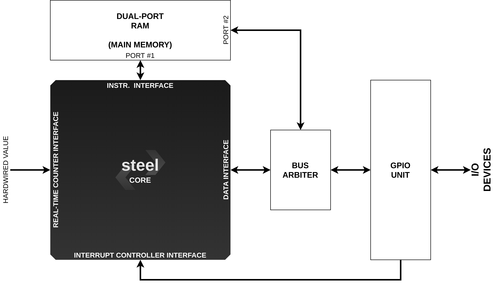

# Getting Started

## What you need to know first

Steel must be connected to a word-addressed memory with read/write latency of 1 clock cycle. The interfaces to fetch instructions and to read/write data were designed to facilitate the integration with FPGA Block RAMs and memory arrays.

If you don't need hardware timers, you must connect the **REAL_TIME** bus to a hardwired value. Otherwise, you must connect it to a real-time counter. The **E_IRQ**, **T_IRQ**, and **S_IRQ** signals (used to request for interrupts) can be connected to a single device or to an interrupt controller that manages interrupts from multiple devices. If interrupts are not needed, these signals must be connected to zero.

## Using Steel in your project

To use Steel in your project you must import all files from the **rtl** directory to it. Then instantiate Steel using the following template:

```verilog
steel_top core(
    .CLK(  ),
    .RESET(  ),
    .REAL_TIME(  ), 
    .I_ADDR(  ),
    .INSTR(  ),
    .D_ADDR(  ),
    .DATA_OUT(  ),
    .WR_REQ(  ),
    .WR_MASK(  ),
    .DATA_IN(  ),
    .E_IRQ(  ),
    .T_IRQ(  ),
    .S_IRQ(  )
);
```

Read the section [Input and Output Signals](steelio.md) for more information on the signals above.

## Writing software for Steel

You can write and compile software for Steel using [RISC-V GNU Toolchain](https://github.com/riscv/riscv-gnu-toolchain). Follow the instructions in its [README.md](https://github.com/riscv/riscv-gnu-toolchain/blob/master/README.md) file for installing the **Newlib** cross-compiler. You must use the following options to configure the installation:

```
./configure --prefix=/opt/riscv --with-arch=rv32i --with-abi=ilp32
make
```
The **util** folder has a script (**mengen.sh**) that compiles a C file (\*.c) and turns the generated program into a **.mem** file, which can be read by the Verilog **$readmemh** system task and then used to initialize a RAM memory array. This script requires **riscv32-unknown-elf-gcc**, **riscv32-unknown-elf-objdump** (provided by RISC-V GNU Toolchain) and **riscv32-unknown-elf-elf2hex** (which can be found [here](https://github.com/sifive/elf2hex)).

## Example system

The figure below shows an example of how Steel can be used as processing unit in embedded systems projects. The same architecture can be used to build other systems. The example is composed of an 8KB RAM memory array (**ram.v**), a memory mapped UART transmitter (**uart_tx.v**, 9600 baud rate, 1 stop bit, no parity and no control), a bus arbiter (**bus_arbiter.v**) and, of course, the Steel Core. The address 0x00010000 is used to access the UART transmitter. RAM addresses start at 0x00000000 and end at 0x00001fff. All other addresses are invalid. The bus arbiter is used to multiplex the data read/write signals according to the address the core wants to access. The timer and interrupt signals are hardwired to zero because neither timers nor interrupts are used in this system. To work properly, the system must be connected to a 100MHz clock source.



The implementation files of this system can be found in the **soc** directory. The **vivado** directory has the project and implementation of this system for an Artix-7 FPGA (Digilent Nexys-4 board) built with Vivado. The **util** directory has an example program (**hello.c**) for it, which can be compiled using the **memgen.sh** script (see the section above). The program sends the string "Hello World, Steel!" through the UART transmitter, which is printed on the screen if the UART is connected to a terminal.

The code below shows how to send data through the UART transmitter in a C program:

```
char* UART_ADDRESS = (char*) 0x00010000; // the UART address

while( (*UART_ADDRESS) != 1 ); // waits UART transmitter to be ready

(*UART_ADDRESS) = 'c'; // send a single character to UART transmitter
```

Or alternatively in RISC-V assembly:

```
lui t0, 0x10 // loads in t0 the UART address

readyloop:
li  t1, 1
lw  t2, 0(t0);
bne t2, t1, readyloop; // checks if the UART is ready
li  t3, 0x63; // loads in t3 the character 'c'
sbu t3, 0(t0); // send the character to UART
```
