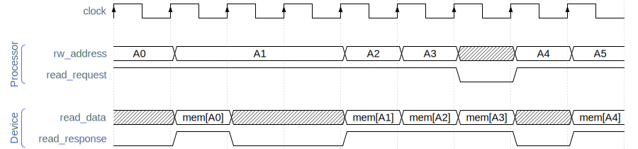
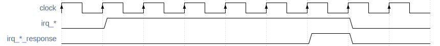

# RISC-V Steel Processor Core IP </br><small>Reference Guide</small>

## Introduction

RISC-V Steel Processor Core is a 32-bit processor core IP implementing the RV32I instruction set, the Zicsr extension and the Machine-mode privileged architecture of RISC-V.

RISC-V Steel Processor Core is a single-issue, in-order, unpipelined processor core.

RISC-V Steel Processor Core can run real-time operating systems and bare-metal embedded software. It is designed to work as a processing unit in a wide variety of embedded applications.

## Source files

RISC-V Steel Processor Core has a single source file, `rvsteel-core.v`, saved in the `riscv-steel/ip/core/` folder.

## I/O signals

**Table 1**{#table-1} - RISC-V Steel Processor Core input and output signals

| **Global signals**{ class="rvsteel-core-io-table" }  |  |  |  |
| -------------- | --------- | | -------------------- |
| **Signal name** | **Direction** | **Size** | **Description** |
| clock      | Input | 1 bit     | Clock input.         |
| reset      | Input | 1 bit     | Reset (active-high). |
| halt       | Input | 1 bit     | Halts the processor core (active-high). |
| **I/O interface**{ class="rvsteel-core-io-table" } | 
| **Signal name** | **Direction** | **Size** | **Description** |
| rw_address | Output | 32 bits     | The address for the read/write operation.  |
| read_data | Input | 32 bits     | The data read from the external device.  |
| read_request | Output | 1 bit     | This signal is set to logic `HIGH` when the processor requests to read from an external device.  |
| read_response | Input | 1 bit | The response to the read request. |
| write_data | Output | 32 bits | The data to write to the device.  |
| write_strobe | Output | 4 bits | A signal indicating which byte lanes of **write_data** must be written. |
| write_request | Output | 1 bit | This signal is set to logic `HIGH` when the processor requests to write to an external device.  |
| write_response | Input | 1 bit | The response to the write request. |
| **Interrupt handling**{ class="rvsteel-core-io-table" } | 
| **Signal name** | **Direction** | **Size** | **Description** |
| irq_external | Input | 1 bit  | Drive this signal to logic `HIGH` to request the processor an external interrupt. |
| irq_external_response | Output | 1 bit  | The response to the external interrupt request. |
| irq_timer | Input | 1 bit  | Drive this signal to logic `HIGH` to request the processor a timer interrupt. |
| irq_timer_response | Output | 1 bit  | The response to the timer interrupt request. |
| irq_software | Input | 1 bit  | Drive this signal to logic `HIGH` to request the processor a software interrupt. |
| irq_software_response | Output | 1 bit  | The response to the software interrupt request. |
| **Real time clock**{ class="rvsteel-core-io-table" } | 
| **Signal name** | **Direction** | **Size** | **Description** |
| real_time_clock | Input | 64 bits | The measured time from a real time clock. |

## Configuration

The only configuration parameter of RISC-V Steel Processor Core is the boot address (`BOOT_ADDRESS`). In case you leave this parameter blank the boot address is automatically set to `32'h00000000`.

## Instantiation template

An instantiation template for RISC-V Steel Processor Core top module is provided below.

``` systemverilog
rvsteel_core #(

  // Address of the first instruction to be fetched and executed

  .BOOT_ADDRESS           ()  // defaults to 32'h00000000 if left blank

) rvsteel_core_instance (

  // Global signals

  .clock                  (),
  .reset                  (), // reset is active-high
  .halt                   (),

  // IO interface

  .rw_address             (),
  .read_data              (),
  .read_request           (),
  .read_response          (),
  .write_data             (),
  .write_strobe           (),
  .write_request          (),
  .write_response         (),

  // Interrupt signals

  .irq_external           (), // hardwire to 1'b0 if unused
  .irq_external_response  (), // leave blank if unused
  .irq_timer              (), // hardwire to 1'b0 if unused
  .irq_timer_response     (), // leave blank if unused
  .irq_software           (), // hardwire to 1'b0 if unused
  .irq_software_response  (), // leave blank if unused

  // Real Time Clock

  .real_time_clock        ()  // hardwire to 64'b0 if unused

);
```

## I/O operations

RISC-V Steel Processor Core communicates with external devices (memory and peripherals) through its I/O interface signals (see [Table 1](#table-1)). In each clock cycle the processor either requests to read or write data (it never requests both operations in the same clock cycle).

As in all RISC-V systems, the processor address space is shared among all devices, both memory and peripherals. Each device is mapped to a region in the address space. Communication with a device takes place by reading and writing data at addresses assigned exclusively to that device.

For example, a system with a 16 KB memory and a UART module could split the processor address space as follows:

- the memory would be assigned the address range from 0x00000000 to 0x00003fff
- the address 0x80000000 would be used to send and receive data from the UART module
- all remaining addresses would be free to be used by other devices

The two sections below explain how read and write operations are requested by the processor core and the expected response to these requests.

### Read operation

The processor core drives the I/O interface signals as follows when making a read request:

- the address is placed in the **rw_address** bus.

- the **read_request** signal is driven to logic `HIGH`.

- the **rw_address** and **read_request** signals remain stable until **read_response** is driven to logic `HIGH` by the external device.

The response to the read request from the external device must observe these rules:

- The read data must be placed in the **read_data** bus.

- the **read_response** signal must be driven to logic `HIGH` only when **read_data** holds valid data, and it must be held `HIGH` for only one clock cycle.

- The read response must never be given in the same clock cycle that **read_request** was driven `HIGH`.

The timing diagram below contains examples of valid read operations:

<figure markdown>
  
  <figcaption><strong>Figure 1</strong> - Read operation timing diagram</figcaption>
</figure>

### Write operation

The processor core drives the I/O interface signals as follows when making a write request:

- the address is placed in the **rw_address** bus.

- the **write_request** signal is driven to logic `HIGH`.

- the data to be written is placed in the **write_data** bus.

- the **write_strobe** signal will indicate which byte lanes of **write_data** must be written.

    For example, if this signal holds `4'b0001`, only the least significant byte must be written. The upper 24 bits of **write_data** must be ignored.

- all signals above remain stable until **write_response** is driven to logic `HIGH` by the external device.

The response to the write request from the external device must observe these rules:

- the **write_response** signal must be driven to logic `HIGH` only if the write operation succeeded, and it must be held `HIGH` for only one clock cycle.

- The write response must never be given in the same clock cycle that **write_request** was driven `HIGH`.

The timing diagram below contains examples of valid write operations:

<figure markdown>
  
  <figcaption><strong>Figure 2</strong> - Write operation timing diagram</figcaption>
</figure>

## Interrupts

There are three interrupt types in the RISC-V architecture: external, timer, and software. RISC-V Steel Processor Core provides dedicated signals (**irq_external**, **irq_timer** and **irq_software**) to request each of these interrupt types.

A device can request an interrupt by driving the **irq_\*** signal to logic `HIGH` and holding it `HIGH` until the request is accepted. The processor accepts the request by driving the **irq_\*_response** signal to logic `HIGH` for one clock cycle. The requesting device can drive the **irq_\*** signal to logic `LOW` in the clock cycle that follows the response, or keep it `HIGH` to make a new request.

The timing diagram below is an example of a valid interrupt request:

<figure markdown>
  
  <figcaption><strong>Figure 3</strong> - Interrupt request timing diagram</figcaption>
</figure>

An interrupt request is accepted if:

- the global interrupt enable bit is set (field **mie** in the **mstatus** CSR), and

- the corresponding interrupt type is enabled (fields **meie**, **mtie** and **msie** in the **mie** CSR).

The processor proceeds as follows when an interrupt request is accepted:

- the execution of the current instruction is aborted.

- the memory address of the aborted instruction is saved in the **mepc** CSR.

- the program counter is set to the value of the **mtvec** CSR.

- the **mcause** CSR is set to a value encoding the type of the interrupt.

- the global interrupt enable bit **mstatus.mie** is set to logic `LOW`, disabling new interrupts.

- the prior interrupt enable bit **mstatus.mpie** is set to logic `HIGH`.

- the corresponding response signal (**irq_\*_response**) is set to logic `HIGH` for one clock cycle.

The **mtvec** CSR is set by software to the address of an interrupt handler routine, so the core branches from normal execution and starts the execution of the interrupt handler.

The **mret** instruction is used by software to return from the interrupt handler. When this instruction is executed the core proceeds as follows:

- the program counter is set to the value of the **mepc** CSR.

- the global interrupt enable bit **mstatus.mie** receives the value saved in the **mstatus.mpie** bit.

- the prior interrupt enable bit **mstatus.mpie** is set to logic `LOW`. 

The value in the **mepc** register is the address of the instruction aborted by the interrupt, so normal execution is resumed.

## Real time clock

Systems that require a real time clock can connect the **time** CSR to an external clock device through the **real_time_clock** bus. By doing so, wall clock time can be obtained by reading the **time** CSR with the **csrrw** instruction.

Systems that do not need a real time clock can hardwire this signal to `64'b0`, which causes reading the **time** CSR to return zero. In this case time lapses can still be measured by reading the cycle counter **mcycle**, as long as the **clock** signal is connected to a stable oscillating signal.

</br>
</br>
</br>
</br>
</br>