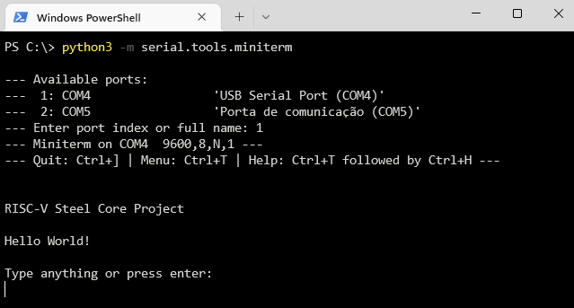

This guide will show you how to get the **Hello World** project running on an [Arty A7-35T](https://digilent.com/shop/arty-a7-artix-7-fpga-development-board/) development board and it's a great starting point for your own projects. It has a working instance of RISC-V Steel and the most basic devices (a RAM memory and an UART unit) so that you can expand it to build more interesting systems.

The Hello World project runs a "Hello, World!" program on RISC-V Steel that sends a "Hello World!" message over Arty's UART bridge and prompts you to type something back. 

## Install prerequisites

Before you start make sure you have the following software installed on your machine:

**AMD Xilinx Vivado**

At the heart of [Arty](https://digilent.com/shop/arty-a7-artix-7-fpga-development-board/) is an AMD Xilinx Artix-7 FPGA so you need to have Vivado installed to be able to program the FPGA on the board.

The latest version of AMD Xilinx Vivado is available for [download here](https://www.xilinx.com/support/download.html). During installation, remember to include support for the Artix-7 device family and the cable drivers.

**pySerial**

[pySerial](https://pyserial.readthedocs.io/en/latest/index.html) is a Python package that allows your computer to communicate over UART serial protocol. To install pySerial open a terminal and run:

```
$ python -m pip install pyserial
```

## Get RISC-V Steel Core

Clone the RISC-V Steel Core repository from GitHub by running:

```
$ git clone https://github.com/riscv-steel/riscv-steel-core.git
```

## Start a serial terminal

First connect Arty to your computer using a USB cable and make sure the board is powered on (a red light on the board must be on). Then start a new pySerial terminal by running:

```
$ python -m serial.tools.miniterm
```

A list of available serial ports will follow. Select the port the board is connected to and **keep the terminal open** for the next steps.

## Program the FPGA

Open Vivado and follow the steps below to get the Hello World project running on [Arty](https://digilent.com/shop/arty-a7-artix-7-fpga-development-board/):

- Open project **hello_world.xpr** (located at **hello_world/vivado/**).

- Click on **Open Hardware Manager**, located in the **Program and Debug** section of the **Flow Navigator**.

- Next, click on **Open Target** > **Auto Connect**.

- Vivado will autodetect Arty's FPGA. The device **xc7a35t_0** should appear in the Hardware box. Right-click on it and choose **Program Device**.

- The bitstream **hello_world.bit** should appear in the input box. To start programming click on the **Program** button.

Arty's FPGA is now programmed with the Hello World project!

## Interact with the Hello World system

As soon as Vivado finishes programming the FPGA the **hello_world.c** program will start running on RISC-V Steel. The program sends the following message over Arty's UART interface:



If you type a character it is echoed back on the screen. If you press Enter the message "You pressed Enter key" is shown.

## Next steps

The Hello World project is intended to quickly introduce you to development with RISC-V Steel. The Arty board was chosen because it is relatively popular among hardware developers. If you develop with Arty you can then easily modify the program (**hello_world.c**) and the HDL (**hello_world.v**) in this project to make the board do smarter things for you.

If you work with other development boards you need to port the Hello World project to it. If you port the project to another platform we'll be happy if you share it opening a [pull request](https://github.com/riscv-steel/riscv-steel-core/pulls)!


</br>

