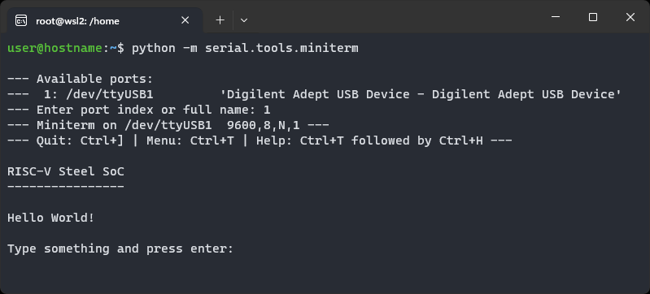

## What is RISC-V Steel?

**RISC-V Steel** is a free collection of RISC-V IP cores. It features a 32-bit RISC-V processor and a configurable system-on-chip design plus a suite of software and hardware tools aimed to speed up building new RISC-V systems from scratch.

RISC-V Steel IP cores are written in Verilog and can be either synthesized on FPGAs or manufactured as custom integrated circuits.

## Available IP cores

#### RISC-V 32-bit Processor

Area-optimized 32-bit processor. Implements the RV32I instruction set of RISC-V, the Zicsr extension and the Machine-mode privileged architecture.

#### RISC-V Steel SoC
  
All configurable system-on-chip design featuring RISC-V Steel 32-bit Processor + Tightly Coupled Memory + UART.

## Hello World demo

The Hello World demo is an instance of RISC-V Steel SoC that runs a program that sends a Hello World message to a host computer via UART protocol. The goal of the demo is to introduce you to our SoC design so that you can expand it and run your own software in it.

This guide will show you the steps to synthesize the Hello World demo for three different FPGA boards:

* **Digilent** [**Arty A7-35T**](https://digilent.com/reference/programmable-logic/arty-a7/reference-manual)

* **Digilent** [**Arty A7-100T**](https://digilent.com/reference/programmable-logic/arty-a7/reference-manual)

* **Digilent** [**Cmod A7**](https://digilent.com/reference/programmable-logic/cmod-a7/reference-manual)

??? question "What if I don't have any of these boards?"

    If you do not have any of these boards try implementing `rvsteel-soc.v` (located at `riscv-steel/hardware/`) in your FPGA. This file is the top module of RISC-V Steel SoC.
    
    We are working to create versions of this guide for other platforms so please let us know which FPGA you use by answering our [poll](https://github.com/riscv-steel/riscv-steel/discussions/10) on GitHub.

## Pre-requisites

To follow this guide you'll need one of the FPGA boards listed above. Also, make sure you have the following software installed on your machine before you start:

* **AMD Xilinx Vivado**

    The latest version of AMD Xilinx Vivado is available for [download here](https://www.xilinx.com/support/download.html). During installation, remember to include support for the Artix-7 device family and the cable drivers.

* **PySerial**

    [PySerial](https://pyserial.readthedocs.io/en/latest/index.html) is a Python package for communication over serial protocol. It can be installed by running:

    ```
    $ python -m pip install pyserial
    ```

## Step by step guide

### 1 - Get RISC-V Steel

* First, clone RISC-V Steel repository from GitHub:

    ```
    $ git clone https://github.com/riscv-steel/riscv-steel.git
    ```

### 2 - Start a serial terminal

* Connect your development board to your computer using a USB cable.
* Start PySerial terminal by running:

    ```
    $ python -m serial.tools.miniterm
    ```

* A list with the available serial ports will follow. Select the serial port the board is connected to.

    { class="getting-started-screenshot" width="500" }

* **Keep the terminal open** for the next steps.

### 3 - Program the FPGA

- Open the project at `riscv-steel/hello-world/<board-name>/hello-world.xpr` on AMD Xilinx Vivado.

- Click on *Open Hardware Manager*, located at the bottom of the *Flow Navigator*.

- Next, click on *Open Target* > *Auto Connect*.

- The FPGA will be autodetected. The hardware box will show either *xc7a35t_0* or *xc7a100t_0*. Right-click on the device name and choose *Program Device*.

- A dialog box asking you to choose a bitstream programming file will open. Choose  `hello_world_<board-name>.bit`, located at `riscv-steel/hello-world/<board-name>/`.

- Click on *Program* and wait Vivado finish programming the FPGA.

- Go back to the serial terminal window. The message below should appear:

    { class="getting-started-screenshot" width="500" }

If you've reached this point, congratulations! You now have a working instance of RISC-V Steel SoC that you can modify to meet your project needs.

</br>
</br>
</br>
</br>
</br>