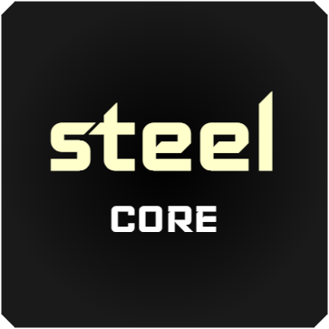

  

## Introduction

Steel is a RISC-V processor core that implements the RV32I and Zicsr instruction sets of the RISC-V specifications. It is designed to be simple and easy to use.

## Key features

* Simple, easy to use
* Free, open-source
* RV32I base instruction set + Zicsr extension + M-mode privileged architecture
* 3 pipeline stages, single-issue
* Hardware described in Verilog
* Full documentation
* RISC-V compliant
* 1.36 CoreMarks/MHz

## Licensing

Steel is distributed under the [MIT License](https://en.wikipedia.org/wiki/MIT_License). The license text is reproduced in the `LICENCE.md` file. Read it carefully and make sure you understand its terms before using Steel in your projects.

## Specifications

Steel aims to be compliant with the following versions of the RISC-V specifications:

* Base ISA RV32I version **2.1**
* Zicsr extension version **2.0**
* Machine ISA version **1.11**

## GitHub repo

Steel files and documentation are available at GitHub ([github.com/rafaelcalcada/steel-core](https://github.com/rafaelcalcada/steel-core)).
