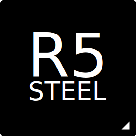

{ align=left width=60 }
# <strong>RISC-V Steel</strong> <small>Free and open RISC-V IP</small>

### What is RISC-V Steel?

---

**RISC-V Steel** is a free and open collection of RISC-V IP that is simple, robust and easy to use. It features a 32-bit RISC-V processor core, a configurable system-on-chip design and a suite of software and hardware tools aimed to speed up building RISC-V embedded applications.

[**:octicons-arrow-right-24: Get started!**](getstarted.md)&nbsp;&nbsp;&nbsp;&nbsp;&nbsp;&nbsp;[:material-git: GitHub](https://github.com/riscv-steel/riscv-steel/)

### Available IP

---

#### Processor Core

RISC-V Steel Processor Core implements the RV32I ISA, the Zicsr extension and the Machine-mode privileged architecture of RISC-V.

[:octicons-arrow-right-24: Documentation](core.md)

#### System-on-Chip

RISC-V Steel System-on-Chip expands the Processor Core IP by adding memory and UART modules to its design. It features a toolchain for software development and demo projects.

[:octicons-arrow-right-24: Documentation](soc.md)&nbsp;&nbsp;&nbsp;&nbsp;&nbsp;&nbsp;&nbsp;&nbsp;[:octicons-arrow-right-24: Software Guide](softwareguide.md)

  