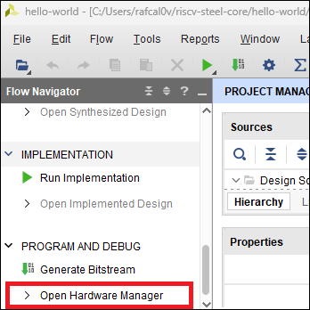
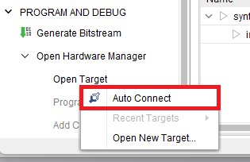
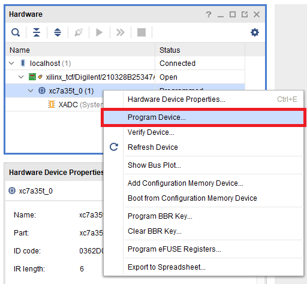
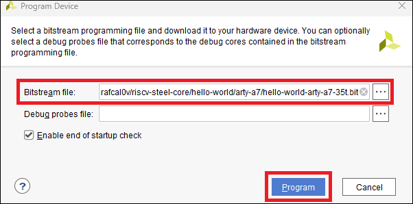

## Introduction

**RISC-V Steel** is a free and open platform for embedded systems development based on the RISC-V instruction set architecture. It is intended for use as a soft-core on FPGA boards and kits and features a 32-bit RISC-V processor core, programmable memory, UART transceiver and an API for software development.

The easiest way to get started with RISC-V Steel is to implement its [Hello World](https://github.com/riscv-steel/riscv-steel/tree/main/hello-world) project on an FPGA development board and expand it to meet your project requirements. In this [Quick Start Guide](https://riscv-steel.github.io/riscv-steel/quick-start-guide/) we will show you the steps to implement this project on three FPGA boards: **Arty A7-35T**, **Arty A7-100T**, and **Cmod-A7**.

If you'd like to have this guide ported to another platform please let us know by opening a [new discussion](https://github.com/riscv-steel/riscv-steel/discussions) on GitHub. We have been working on creating versions of this guide for other FPGA boards and kits.

## Hello World project overview

The Hello World project was developed to be a minimal system easily portable to different FPGA boards, upon which it can then be expanded.

FPGA boards often include a UART-USB bridge for communicating with a host computer. The Hello World project takes advantage of this feature to send a *Hello World!* message via UART protocol. This message can be read on a host computer connected via USB cable to the FPGA's UART-USB bridge.

To send the message, a *Hello World!* program is loaded into memory and executed by the RISC-V processor in RISC-V Steel. The program controls the UART interface by sending the message and echoing back any bytes received in response.

## Requirements

### Hardware

To follow this guide you need one of the following development boards:

* **Digilent** [**Arty A7-35T**](https://digilent.com/reference/programmable-logic/arty-a7/reference-manual)

* **Digilent** [**Arty A7-100T**](https://digilent.com/reference/programmable-logic/arty-a7/reference-manual)

* **Digilent** [**Cmod A7**](https://digilent.com/reference/programmable-logic/cmod-a7/reference-manual)

### Software

Make sure you have the following software installed on your machine before you start:

* **AMD Xilinx Vivado**

    The latest version of AMD Xilinx Vivado is available for [download here](https://www.xilinx.com/support/download.html). During installation, remember to include support for the Artix-7 device family and the cable drivers.

* **PySerial**

    [PySerial](https://pyserial.readthedocs.io/en/latest/index.html) is a Python package for communication over serial protocol (UART). It can be installed by running:

    ```
    $ python -m pip install pyserial
    ```

## Step by step guide
### 1. Get RISC-V Steel

* First, clone RISC-V Steel repository from GitHub:

    ```
    $ git clone https://github.com/riscv-steel/riscv-steel.git
    ```

### 2. Start a serial terminal

<div class="annotate" markdown>

Click on :material-plus-circle: to see screenshots.

* Connect the development board to your computer using a USB cable.
* Start a PySerial terminal by running:

    ```
    $ python -m serial.tools.miniterm
    ```

* (1) A list of available serial ports will follow. Select the serial port the board is connected to.
* **Keep the terminal open** for the next steps.

</div>

1. 

### 3. Program the FPGA

<div class="annotate" markdown>

Click on :material-plus-circle: to see screenshots.

- Open the project at `./hello-world/<board-name>/hello-world.xpr` on AMD Xilinx Vivado.

- (1) Click on *Open Hardware Manager*, located at the bottom of the *Flow Navigator*.

- (2) Next, click on *Open Target* -> *Auto Connect*.

- (3) Vivado will autodetect the FPGA. The hardware box will show either `xc7a35t_0` or `xc7a100t_0`. Right-click on the device name and choose *Program Device*.

- (4) A dialog box asking you to choose a bitstream programming file will open. Choose `hello_world_<board-name>.bit`, located at `./hello-world/<board-name>/`.

- (5) Click on *Program* and wait Vivado finish programming the FPGA.

- (6) Go back to the serial terminal window. The message below should appear:

    ```
    RISC-V Steel Hello World Project!
    Type something and press enter:
    ```

</div>

1. 

2. 

3. 

4. 

5. 

6. 

If you've reached this point, congratulations! You now have a working instance of RISC-V Steel that you can modify to meet your project needs.

</br>
</br>
</br>
</br>
</br>