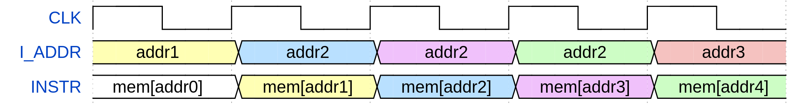

# Timing Diagrams

## Instruction fetch

To fetch an instruction, the core places the instruction address on **I_ADDR**. The memory must place the instruction on **INSTR** at the next clock rising edge. The figure below shows the timing diagram of this process. In the figure, **mem[addrX]** denotes the instruction stored at the memory position **addrX**.

## Data fetch

To fetch data from memory, the core puts the data address on **D_ADDR**. The memory must place the data on **DATA_IN** at the next clock rising edge. The figure below shows the timing diagram of this process. In the figure, **mem[addrX]** denotes the data stored at the memory position **addrX**.

## Data writing

To write data to memory, the core drives **D_ADDR**, **DATA_OUT**, **WR_REQ** and **WR_MASK** signals as follows:

* **D_ADDR** receives the address of the memory position where the data must be written;
* **DATA_OUT** receives the data to be written;
* **WR_REQ** is set high;
* **WR_MASK** receives a byte-write enable mask that indicates which bytes of **DATA_OUT** must be written.

The memory must perform the write operation at the next clock rising edge. The core can request to write bytes, halfwords and words.

The figure below shows the process of writing data to memory. **DATA_IN** is not used in the process and appears only to show the memory contents after writing. The figure shows five clock cycles, in which the core requests to write in the second, third and fourth cycles. In the second clock cycle, the core requests to write the word **0x12345678** at the address **addr2**. In the third, requests to write the halfword **0xABCD** at the upper half of **addr2**, and in the fourth requests to write the byte **0xEF** at the second least significant byte of **addr2**. The value stored at **addr2** after each of these operations appears on **DATA_IN** and are highlighted in blue.

## Interrupt request

An external device (or an interrupt controller managing several devices) can request interrupts by setting high the appropriate IRQ signal, which is **E_IRQ** for external interrupts, **T_IRQ** for timer interrupts and **S_IRQ** for software interrupts. The IRQ signal of the requested interrupt must be set high for one clock cycle and set low for the next.

The figure below shows the timing diagram of the interrupt request process. Since the process is the same for all types of interrupt, **X_IRQ** is used to denote **E_IRQ**, **T_IRQ** or **S_IRQ**. **TRAP_ADDR** denotes the address of the trap handler first instruction.

</img>

## Time CSR update

When connected to a real-time counter, the core updates the **time** CSR with the value placed on **REAL_TIME** at each clock rising edge, as shown in the figure below. **timeX** denotes arbitrary time values.

</img>

