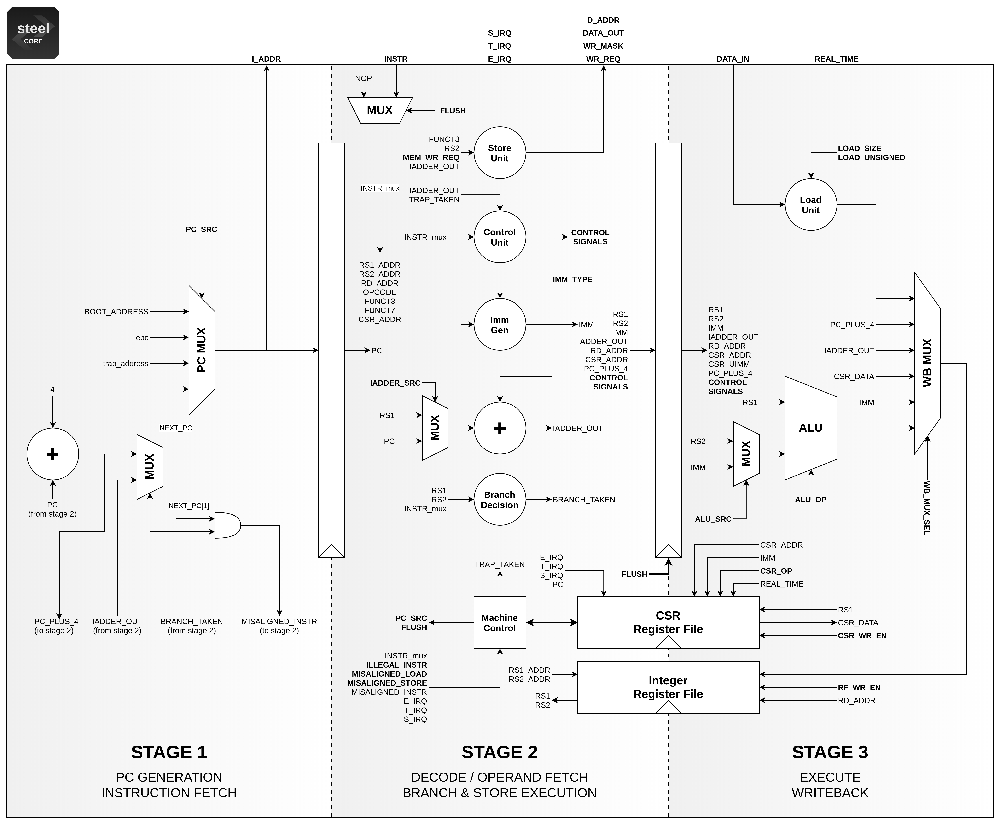

# Microarchitecture

Steel has 3 pipeline stages, a single execution thread and issues only one instruction per clock cycle. Therefore, all instructions are executed in program order.

Fig. 1 (below) shows the Steel microarchitecture in register-transfer level (RTL). Circles and trapezoids represent combinational logic units. Rectangles represent sequential logic units. Implementation details can be found in the section [Implementation Details](details.md).

**Fig. 1:** Steel Core microarchitecture

Fig. 2 (below) shows the tasks performed by each pipeline stage. In the first stage, the core generates the program counter and fetches the instruction from memory. In the second, the instruction is decoded and the control signals for all units are generated. Branches, jumps and stores are executed in advance in this stage, which also generates the immediates and fetches the data from memory for load instructions. The last stage executes all other instructions and writes back the results in the register file.

</img>
 
 
<strong>Fig. 2:</strong> Steel Core pipeline overview

